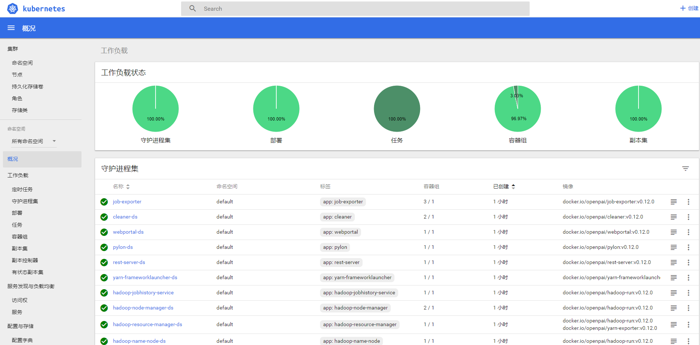
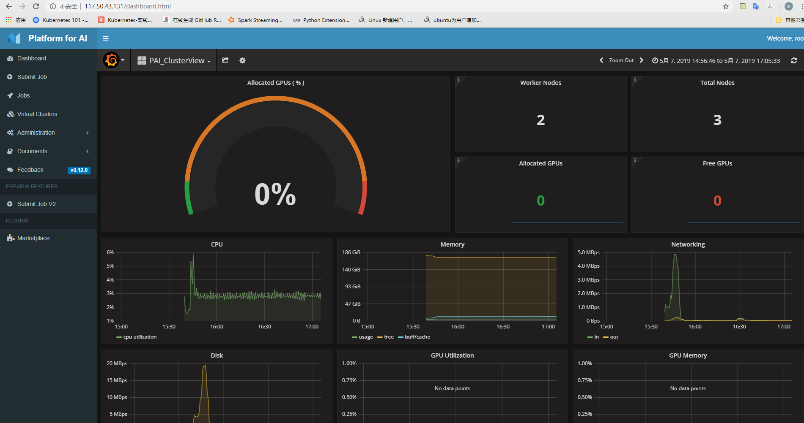

# openPAI

## 相关介绍

[OpenPAI简介](https://www.msra.cn/zh-cn/news/features/openpai)  

[OpenPAI GitHub地址](https://github.com/Microsoft/pai/blob/master/README_zh_CN.md)

## 配置介绍
 
### 集群管理节点

- 系统：Ubuntu Server 16.04
- 内存：16G
- cpu核数：4核

### 集群节点（3台）

- 系统：Ubuntu Server 16.04
- 内存：64G
- cpu核数：16核

## 环境要求

> - 确保每台服务器都有静态IP地址，可以互相通信
>- 确保服务器可以访问互联网，可以拉取OpenPAI的Docker镜像
>- 确保SSH服务已启用，所有服务器使用相同的用户名的密码，并启用sudo权限
>- 确保NTP服务已启用

## 安装步骤

### 准备部署环境

> 这里有两种方式进行环境部署  
> - [使用dev-box container作为环境](https://github.com/microsoft/pai/blob/master/docs/zh_CN/pai-management/doc/how-to-setup-dev-box.md)  
> - [直接在主机上安装依赖的软件](https://github.com/microsoft/pai/blob/master/docs/zh_CN/pai-management/doc/how-to-install-depdencey.md)  
>
>`如果您想在属于OpenPAI的计算机上管理群集，请选择选项2.否则，强烈建议使用选项1`

***
我这里选择选项1，大家可以按照实际要求进行部署
***
#### dev-box安装

>Dev-Box是一个docker容器，其中包含用于paictl部署和管理集群的必要依赖软件。使用开发盒，您不再需要在主机环境中安装软件，使主机环境的软件包保持干净。

- 安装docker并拉取dev-box
```
sudo apt-get -y install docker.io  
#最好能指定版本，后面配置文件需要指明版本
sudo docker pull docker.io/openpai/dev-box:v0.12.0
```

- 运行dev-box
```
sudo docker run -itd \  
        -e COLUMNS=$COLUMNS -e LINES=$LINES -e TERM=$TERM \  
        -v /var/run/docker.sock:/var/run/docker.sock \  
        -v /pathConfiguration:/cluster-configuration  \  
        -v /hadoop-binary:/hadoop-binary  \  
        --pid=host \  
        --privileged=true \  
        --net=host \  
        --name=dev-box \  
        docker.io/openpai/dev-box:v0.12.0
```

- 登录dev-box
```
sudo docker exec -it dev-box /bin/bash  
cd /pai
```

#### 集群配置

- 编写quick-start.yaml
```
cd /pai/deployment/quick-start/  
cp quick-start-example.yaml quick-start.yaml  
vim quick-start.yaml
```
替换自己的集群ip和ssh信息，ip最好使用内网ip，公网ip可能会被限制访问
```
# quick-start.yaml

# (Required) Please fill in the IP address of the server you would like to deploy OpenPAI
machines:

  - 192.168.1.11
  - 192.168.1.12
  - 192.168.1.13

# (Required) Log-in info of all machines. System administrator should guarantee
# that the username/password pair or username/key-filename is valid and has sudo privilege.
ssh-username: pai
ssh-password: pai-password

# (Optional, default=None) the key file that ssh client uses, that has higher priority then password.
#ssh-keyfile-path: <keyfile-path>

# (Optional, default=22) Port number of ssh service on each machine.
#ssh-port: 22

# (Optional, default=DNS of the first machine) Cluster DNS.
#dns: <ip-of-dns>

# (Optional, default=10.254.0.0/16) IP range used by Kubernetes. Note that
# this IP range should NOT conflict with the current network.
#service-cluster-ip-range: <ip-range-for-k8s>
```
- 生成配置文件
```
cd /pai  
python paictl.py config generate -i /pai/deployment/quick-start/quick-start.yaml -o ~/pai-config -f  
cd ~/pai-config/
```

kubernetes-configuration.yaml  
只需要修改docker-registry，国内访问不了Google镜像库，替换国内的就可以  
```
# Copyright (c) Microsoft Corporation
# All rights reserved.
#
# MIT License
#
# Permission is hereby granted, free of charge, to any person obtaining a copy of this software and associated
# documentation files (the "Software"), to deal in the Software without restriction, including without limitation
# the rights to use, copy, modify, merge, publish, distribute, sublicense, and/or sell copies of the Software, and
# to permit persons to whom the Software is furnished to do so, subject to the following conditions:
# The above copyright notice and this permission notice shall be included in all copies or substantial portions of the Software.
#
# THE SOFTWARE IS PROVIDED *AS IS*, WITHOUT WARRANTY OF ANY KIND, EXPRESS OR IMPLIED, INCLUDING
# BUT NOT LIMITED TO THE WARRANTIES OF MERCHANTABILITY, FITNESS FOR A PARTICULAR PURPOSE AND
# NONINFRINGEMENT. IN NO EVENT SHALL THE AUTHORS OR COPYRIGHT HOLDERS BE LIABLE FOR ANY CLAIM,
# DAMAGES OR OTHER LIABILITY, WHETHER IN AN ACTION OF CONTRACT, TORT OR OTHERWISE, ARISING FROM,
# OUT OF OR IN CONNECTION WITH THE SOFTWARE OR THE USE OR OTHER DEALINGS IN THE SOFTWARE.

kubernetes:
  # Find the namesever in  /etc/resolv.conf
  cluster-dns: 10.46.255.1
  # To support k8s ha, you should set an lb address here.
  # If deploy k8s with single master node, please set master IP address here
  load-balance-ip: 10.46.179.174

  # specify an IP range not in the same network segment with the host machine.
  service-cluster-ip-range: 10.254.0.0/16
  # According to the etcdversion, you should fill a corresponding backend name.
  # If you are not familiar with etcd, please don't change it.
  storage-backend: etcd3
  # The docker registry used in the k8s deployment. If you can access to gcr, we suggest to use gcr.
  docker-registry: docker.io/mirrorgooglecontainers
  # http://gcr.io/google_containers/hyperkube. Or the tag in your registry.
  hyperkube-version: v1.9.9
  # http://gcr.io/google_containers/etcd. Or the tag in your registry.
  # If you are not familiar with etcd, please don't change it.
  etcd-version: 3.2.17
  # http://gcr.io/google_containers/kube-apiserver. Or the tag in your registry.
  apiserver-version: v1.9.9
  # http://gcr.io/google_containers/kube-scheduler. Or the tag in your registry.
  kube-scheduler-version: v1.9.9
  # http://gcr.io/google_containers/kube-controller-manager
  kube-controller-manager-version:  v1.9.9
  # http://gcr.io/google_containers/kubernetes-dashboard-amd64
  dashboard-version: v1.8.3
  # The path to storage etcd data.
  etcd-data-path: "/var/etcd"

  # #Enable QoS feature for k8s or not. Default value is "true"
  # qos-switch: "true"
```

layout.yaml  
填写自己的机器配置信息  
```
# If corresponding values aren't be set in the machine list, the default value will be filled in.

# kubernetes api server and dashboard host
kubernetes:
  api-servers-url: http://10.46.179.174:8080
  dashboard-url: http://10.46.179.174:9090

# TODO please modify it according to your own hardware
machine-sku:
  GENERIC:
    mem: 62G
    gpu:
      type: generic
      count: 1
    cpu:
      vcore: 16
    os: ubuntu16.04

machine-list:
  - dashboard: "true"
    docker-data: "/var/lib/docker"
    etcdid: "etcdid1"
    hostip: "10.46.179.174"
    hostname: "10-46-179-174"
    k8s-role: "master"
    machine-type: "GENERIC"
    nodename: "10.46.179.174"
    pai-master: "true"
    password: "xiulian"
    ssh-port: "22"
    username: "openpai"
    zkid: "1"

  - docker-data: "/var/lib/docker"
    hostip: "10.46.178.107"
    hostname: "10-46-178-107"
    k8s-role: "worker"
    machine-type: "GENERIC"
    nodename: "10.46.178.107"
    pai-worker: "true"
    password: "xiulian"
    ssh-port: "22"
    username: "openpai"

  - docker-data: "/var/lib/docker"
    hostip: "10.46.28.140"
    hostname: "10-46-28-140"
    k8s-role: "worker"
    machine-type: "GENERIC"
    nodename: "10.46.28.140"
    pai-worker: "true"
    password: "xiulian"
    ssh-port: "22"
    username: "openpai"

```
services-configuration.yaml  
tag 按实际的版本填写，不然后面可能会出错  
cluster-id可以改一下，后面会用到  
rest-server下面的用户名和密码最好改一下，后面登录平台的时候用到  

```
cluster:
  common:
    cluster-id: xiulian
  #
  #  # HDFS, zookeeper data path on your cluster machine.
  #  data-path: "/datastorage"

  # the docker registry to store docker images that contain system services like frameworklauncher, hadoop, etc.
  docker-registry:

    # The namespace in your registry. If the registry is docker.io, the namespace will be your user account.
    namespace: openpai

    # E.g., gcr.io.
    # if the registry is hub.docker, please fill this value with docker.io
    domain: docker.io
    # If the docker registry doesn't require authentication, please comment username and password
    #username: <username>
    #password: <password>

    tag: v0.12.0

    # The name of the secret in kubernetes will be created in your cluster
    # Must be lower case, e.g., regsecret.
    secret-name: pai-secret


#Uncomment following lines if you want to customize yarn
#hadoop-resource-manager:
#  # job log retain time
#  yarn_log_retain_seconds: 2592000
#  # port for yarn exporter
#  yarn_exporter_port: 9459


#Uncomment following lines if you want to customize hdfs
#hadoop-data-node:
#  # storage path for hdfs, support comma-delimited list of directories, eg. /path/to/folder1,/path/to/folder2 ...
#  # if left empty, will use cluster.common.data-path/hdfs/data
#  storage_path:


# uncomment following if you want to change customeize yarn-frameworklauncher
#yarn-frameworklauncher:
#  frameworklauncher-port: 9086


rest-server:
  # database admin username
  default-pai-admin-username: root
  # database admin password
  default-pai-admin-password: xiulian
```

#### 部署Kubernetes

http://\<master>:9090 查看进度,需要等待一段时间  

```
cd pai

python paictl.py cluster k8s-bootup \
  -p ~/pai-config
```

#### 更新配置文件到kubernetes

```
cd pai  

python paictl.py config push -p ~/pai-config/ -c ~/.kube/config
```

#### 启动OpenPAI

如果不指定-n，默认下载所有的service，包括rest-server, webportal, watchdog等    
这里需要等待比较长的时间  

```
cd pai

python paictl.py service start \
  [ -c ~/.kube/config] \
  [ -n service-name ]
```

### 安装结束





### 卸载

```
# 卸载openpai组件
cd /pai  
python paictl.py service delete -c ~/.kube/config  

# 卸载k8s组件  
cd /pai  
python paictl.py cluster k8s-clean -p ~/pai-config/
```